# sj-design — Presentation Skill for Claude Code

A Claude Code skill that generates beautiful, animated HTML slide decks from natural language prompts. Describe what you need; get a self-contained `.html` file with cinematic animations, Apple design tokens, and physics-based glass refraction fills — ready to open in any browser.

> Building native iOS under the Studio Joe design system? See [docs/swiftui-conventions.md](docs/swiftui-conventions.md) for the iOS 26 Liquid Glass mappings.

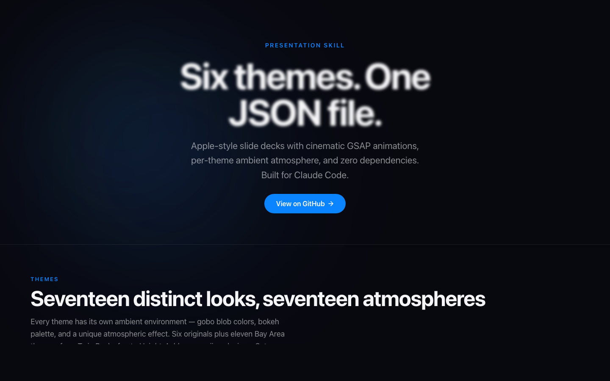

---

## What it produces

Every deck is a single `.html` file with no external dependencies:

- **8 slide layouts** — title, content, stats, quote, two-column, gallery, media, closing
- **17 themes** — dark, light, and atmospheric (see below)
- **Cinematic GSAP animations** — Apple `cubic-bezier(0.16, 1, 0.3, 1)` expo-out, spring easing, per-element stagger
- **Ambient atmosphere** — Perlin-noise gobo blobs, starfields, bokeh discs, SF fog layers, fireflies, rain, confetti — unique per theme, no config needed
- **Glass Refraction** — physics-based frosted glass fills with 4-edge specular bezels, SVG `feDisplacementMap` rim refraction, and `feGaussianBlur` — works in Chrome, Firefox, and Safari
- **Stats count-up** — animated number counters that spring in from zero; supports `$`, `%`, `+`, commas
- **Ken Burns gallery** — photo slideshow with continuous pan/zoom crossfades
- **YouTube / video / image embeds** — auto-detected from URL; local files base64-embedded
- **HUD controls** — slide counter, text-size presets (persisted in localStorage), emoji rain toggle, progress bar
- **Keyboard + click + swipe navigation** — `→` / `Space` advance, `←` back, `F` fullscreen

---

## Usage

Claude Code picks up the skill automatically. Just describe what you want:

```
Make me a 6-slide presentation about the history of the internet
```

```
Create a pitch deck for a SaaS startup. Use the Obsidian theme.
```

```
Build a property overview for 740 37th Ave — stats: $5,340 current rent,
$10,400 market potential, $1.66M projected 2031 value. Gallery of exterior photos.
```

```
Quarterly business review — revenue stats, Q3 vs Q4 two-column comparison,
key wins, strong closing. Dark theme.
```

```
10-slide product launch deck for our AI writing tool. B2B audience.
Include a demo slide with this YouTube link and a quote from a beta user.
```

Claude plans a narrative arc, writes content following Apple Style Guide rules, builds a JSON spec, runs the build script, and opens the result.

---

## Themes

| Theme | Key | Atmosphere |
|-------|-----|------------|
| **Blue Hour** | `dark` | Starfield · Perlin gobo blobs · SF fog · bokeh |
| **Crissy Field** | `light` | Warm bokeh · blue gradient · Perlin blobs |
| **Obsidian** | `obsidian` | Floating dust particles · green-tinted gobos |
| **Deep Space** | `deep-space` | 200-star field · cyan/violet/pink nebula |
| **Noir** | `noir` | Film grain · venetian blinds · rain streaks · crimson bloom |
| **Golden Hour** | `golden-hour` | Warm amber bokeh · amber-to-cream gradient |
| **Twin Peaks** | `twin-peaks` | City glow · teal fog · night purple/teal gobos |
| **Embarcadero** | `embarcadero` | Steel-blue fog · grey-blue bokeh |
| **Muir Woods** | `muir-woods` | Blinking fireflies · deep forest green gobos |
| **The Mission** | `the-mission` | Warm orange/pink gradients · vivid saturated gobos |
| **Santa Cruz** | `santa-cruz` | Aqua/seafoam bokeh · ocean blue gobos |
| **Sausalito** | `sausalito` | Soft teal/silver bokeh · harbour mist |
| **Half Moon Bay** | `half-moon-bay` | Coastal fog · storm grey/slate gobos |
| **Redwood** | `redwood` | Amber fireflies · deep burgundy/forest gobos |
| **The Richmond** | `the-richmond` | SF fog · cool lavender/grey gobos |
| **Nob Hill** | `nob-hill` | Champagne bokeh · gold/ivory gobos · light mist |
| **Haight** | `haight` | Floating emoji · spinning mandala · confetti · explosion on nav |

Specify a theme in your prompt or let Claude choose based on context.

### Theme gallery

| | |
|---|---|
| 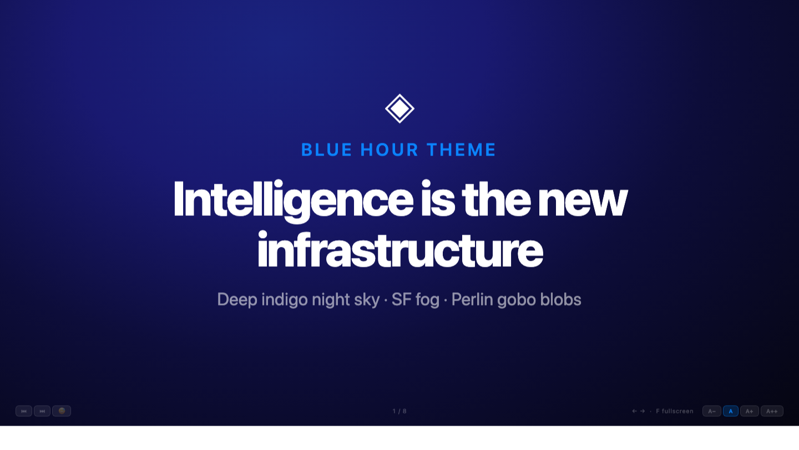 | 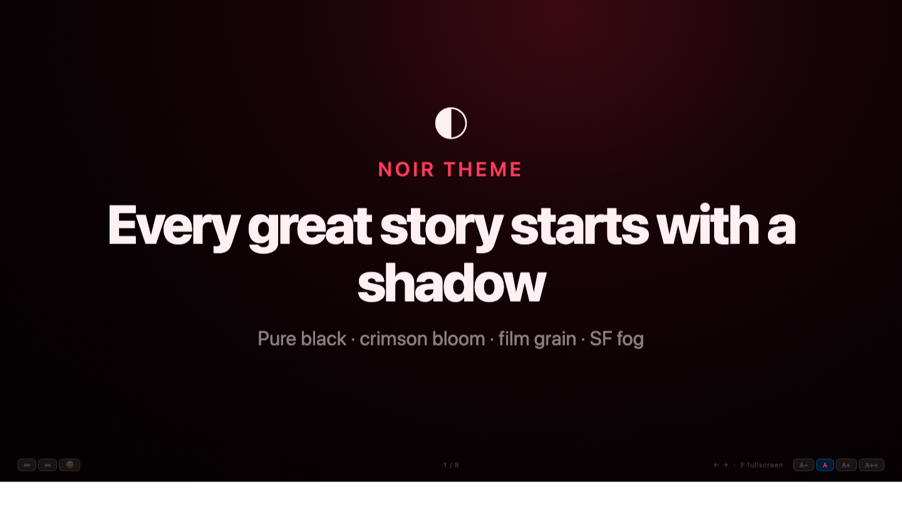 |
| **Blue Hour** — deep indigo night sky, SF fog, Perlin gobo blobs | **Noir** — pure black, crimson bloom, film grain, rain streaks |
| 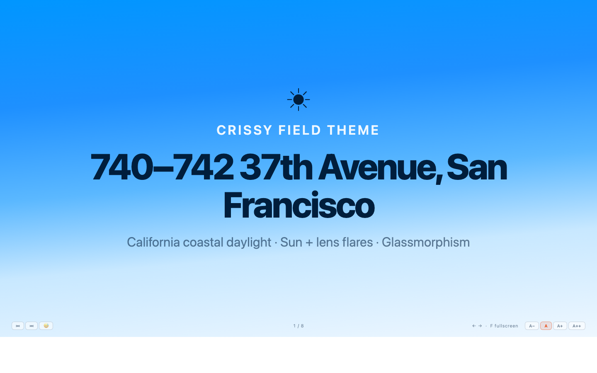 | 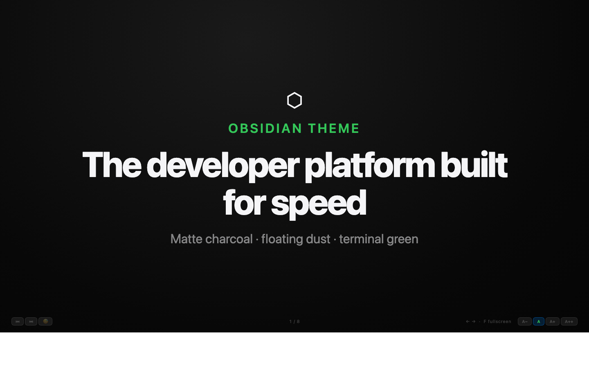 |
| **Crissy Field** — California coastal daylight, warm blue gradient | **Obsidian** — matte charcoal, floating dust particles, terminal green |
| 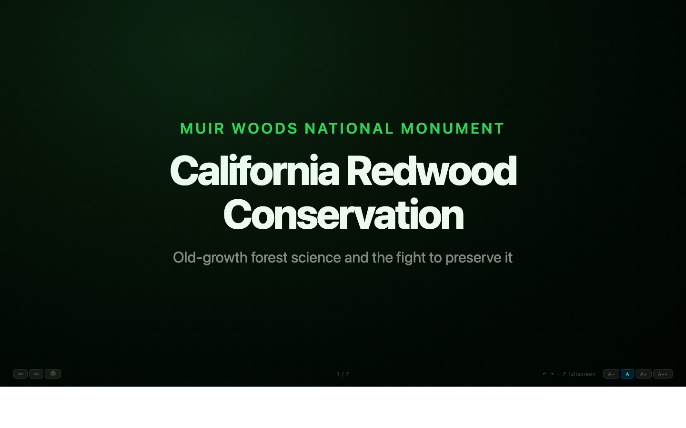 | 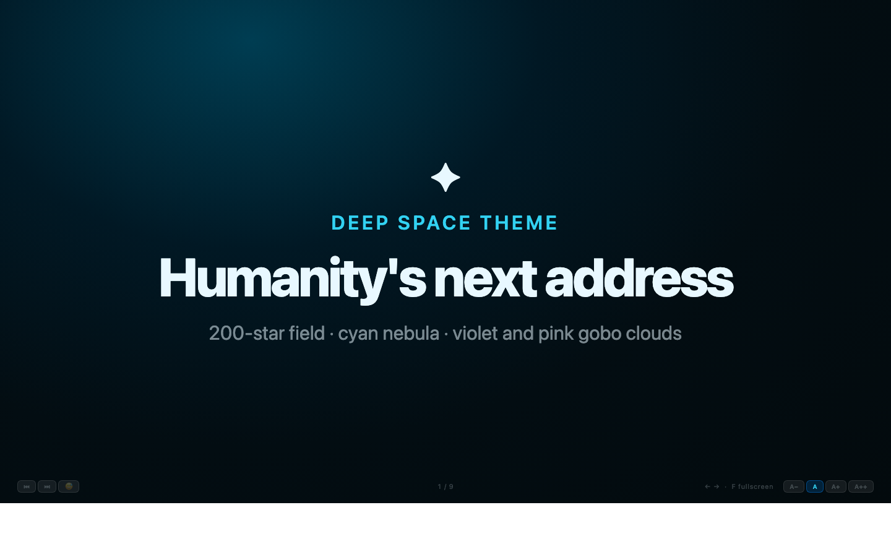 |
| **Muir Woods** — deep forest, blinking fireflies, green gobos | **Deep Space** — 200-star field, cyan/violet/pink nebula |
| 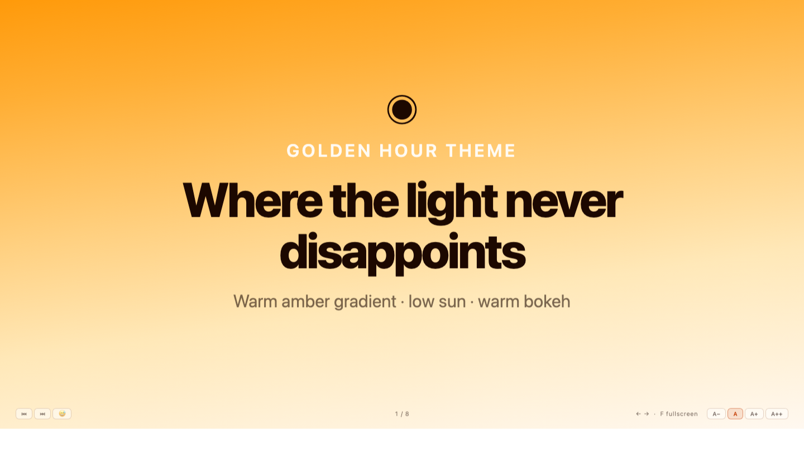 | 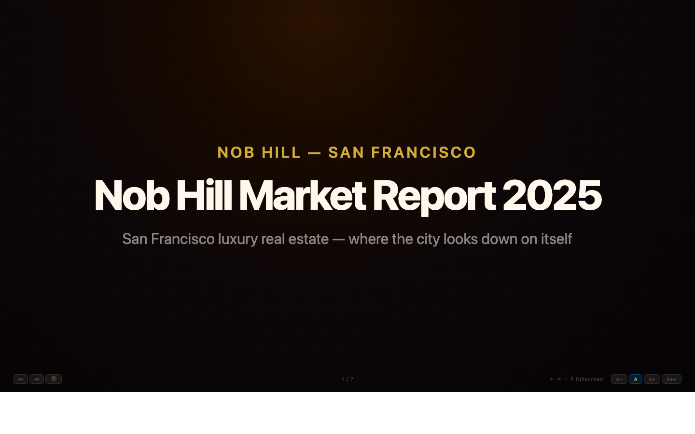 |
| **Golden Hour** — warm amber gradient, low sun bokeh | **Nob Hill** — champagne bokeh, gold/ivory gobos, light mist |
| 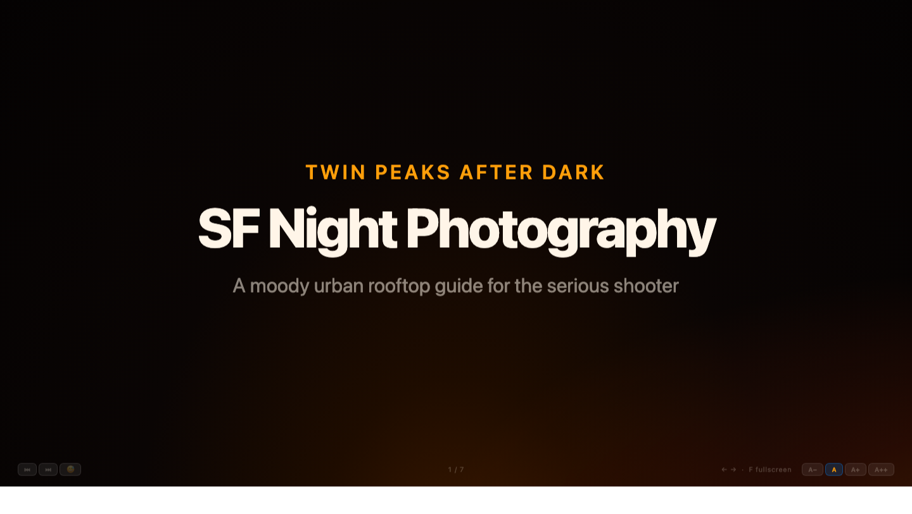 | 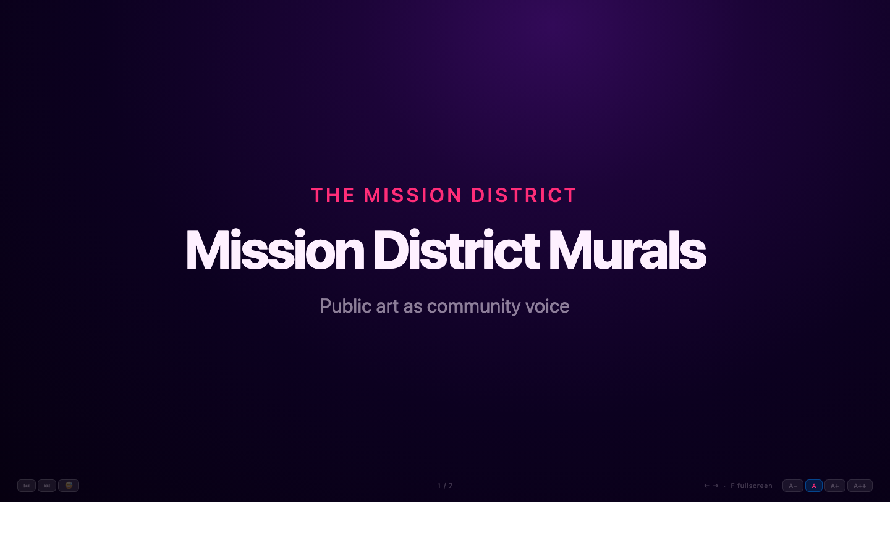 |
| **Twin Peaks** — city glow, teal fog, night purple gobos | **The Mission** — warm orange/pink gradients, vivid saturated gobos |
| 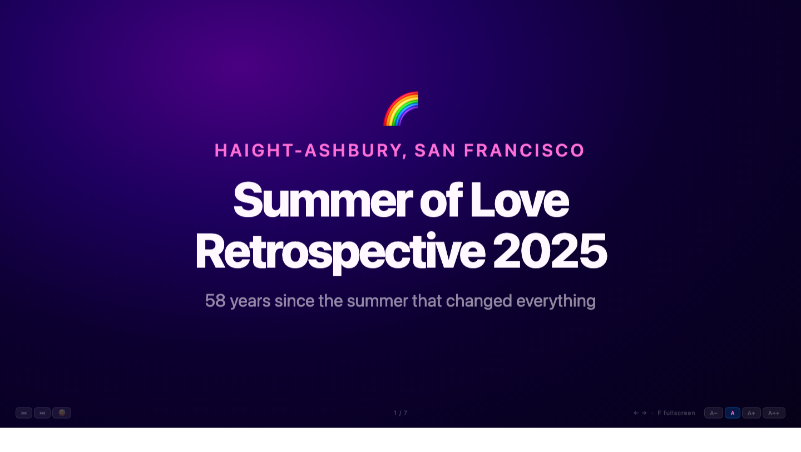 | |
| **Haight** — floating emoji, spinning mandala, confetti explosion | |

---

## Slide types

| Type | Best for |
|------|----------|
| `title` | Opening slide, section breaks |
| `content` | Bullets, features, key points |
| `stats` | Metrics, financials, KPIs — animated count-up |
| `quote` | Social proof, pull quotes |
| `two-column` | Comparisons, before/after, side-by-side |
| `gallery` | Photo showcases — Ken Burns slideshow |
| `media` | YouTube, video files, images |
| `closing` | CTA, thank you, contact info |

---

## Navigation

| Input | Action |
|-------|--------|
| `→` / `Space` / click right half | Next slide |
| `←` / click left half | Previous slide |
| `F` | Fullscreen |
| Swipe left / right | Next / previous (touch) |
| `⏮ ⏭` buttons | Jump to first / last slide |
| `A−  A  A+  A++` | Text size presets |

---

## File structure

```
sj-design/
├── SKILL.md                          # Skill definition — Claude reads this
├── scripts/
│   └── build_presentation.py         # Builds HTML from a JSON spec
├── assets/
│   └── template.html                 # GSAP template with all 17 themes
├── showcase/
│   ├── index.html                    # Design system showcase
│   ├── glass-refraction-demo.html        # Interactive Glass Refraction technique demo
│   └── decks/                        # Example generated decks
└── evals/
    └── evals.json                    # Eval test cases
```

---

## Build manually

```bash
python3 scripts/build_presentation.py spec.json -o deck.html
open deck.html
```

Pipe via stdin:

```bash
echo '{"title":"My deck","theme":"dark","slides":[...]}' \
  | python3 scripts/build_presentation.py
```

---

## Glass Refraction

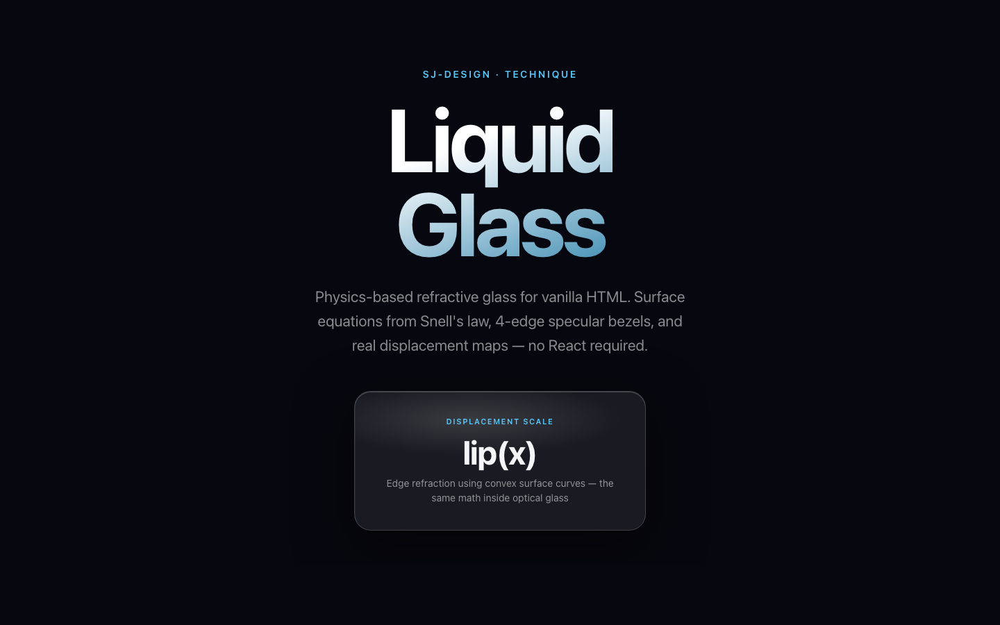

The template uses a physics-based glass refraction technique, ported from `@hashintel/refractive` (MIT/Apache-2.0) to vanilla JS/CSS/SVG:

- **Surface equations** — `convexCircle`, `convex`, `concave`, `lip(x)` model light refraction through curved glass using Snell's law
- **64×64 displacement map** — generated at runtime in a canvas, encoded as PNG, fed into `feImage` → `feDisplacementMap`
- **Rim-focused displacement** — peak refraction at ~6–10% inward from each edge; exact border pixels are always neutral (card shape never warps)
- **4-edge specular bezel** — `inset` box-shadows on all four edges with per-theme accent tints simulate light catching each face of the glass rim
- **Cross-browser** — `feGaussianBlur` in the SVG filter chain handles blur; the displacement is applied to the background element rather than the glass card itself, avoiding Safari's `filter + backdrop-filter` compositing limitation

See [`showcase/glass-refraction-demo.html`](showcase/glass-refraction-demo.html) for an interactive breakdown of each technique layer.

---

Built with [Claude Code](https://claude.ai/code) · Animations by [GSAP](https://gsap.com) · Apple design tokens
